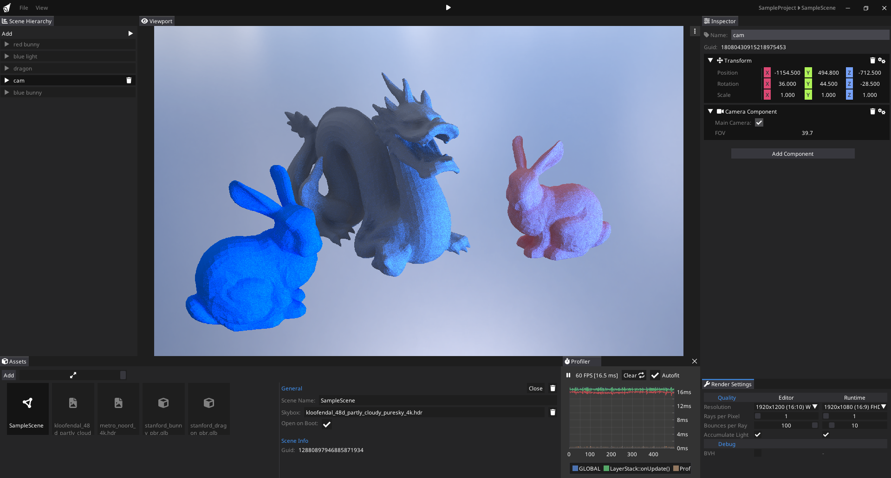
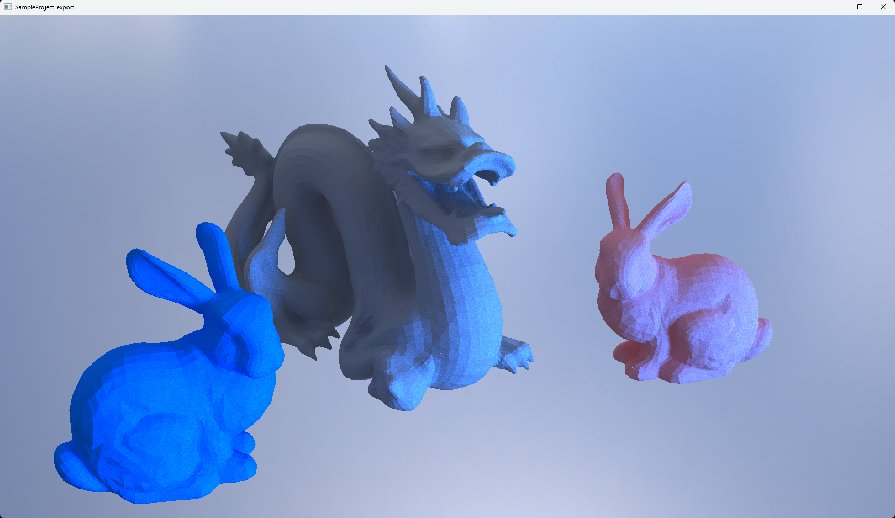
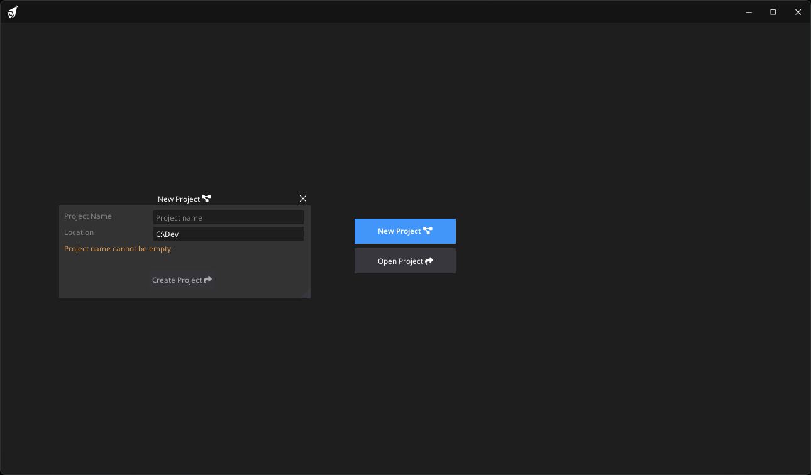
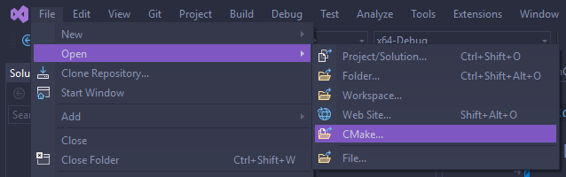
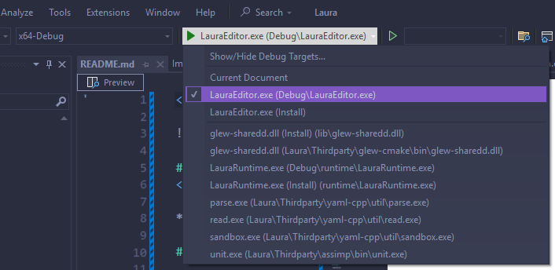
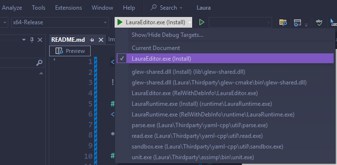
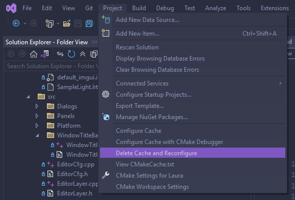

<div align="center">


    <a href="https://www.youtube.com/@JacobGordiak" target="_blank" rel="noopener">
    
    </a>

</div>

# 3D Path Tracing Game Engine

**Laura** is a lightweight, Windows-only **3D path tracing** engine. It focuses on rendering 3D scenes using path tracing, enabling developers to experiment with 3D light transport simulation in virtual environments. While not as feature-packed as larger engines, Laura provides a simple and approachable platform to learn and experiment with 3D rendering concepts. 

### Free, open source, and MIT licensed

Laura is completely free and open source under the permissive **[MIT license](./LICENSE)**. Users are free to use, modify, and distribute their projects without royalties or restrictions. The engine is designed to be lightweight, accessible, and extendable, empowering developers to experiment with path tracing and 3D rendering techniques.


> [!NOTE]
> **Laura – Light-Aura** takes its name from its focus on light and realism: *“Laura”* evokes a personal, approachable engine, while *“Light Aura”* reflects its core strength in tracing realistic light paths and producing natural illumination in 3D scenes.


<p align="center">
  <strong>Editor</strong><br>
  
</p>

After designing and configuring your scene in the editor, export it via **File → Export** and run the generated application to see your work in action.


<p align="center">
  <a href="./.github/assets/runtime.png" title="Exported runtime (click to enlarge)">
    
  </a>
  &nbsp;&nbsp;
  <a href="./.github/assets/launcher.png" title="Launcher (click to enlarge)">
    
  </a>
  <br>
  <small><em>Left: exported runtime — Right: opening launch window of the editor.</em></small>
</p>

The project is structured into three CMake targets:

- **LauraEngine**: The core engine as a static library. It implements the renderer, scene and asset systems, platform abstraction, and utility subsystems. Third-party dependencies (GLFW, GLEW, GLM, Assimp, spdlog, EnTT, yaml-cpp, stb) are vendored and built via CMake.  
- **LauraEditor**: A fully-featured editor application (ImGui-based) for authoring projects, scenes, materials, and settings, backed by `LauraEngine`.  
- **LauraRuntime**: A lean runtime player that loads and runs exported projects using `LauraEngine`.

## Highlights
- **C++20** across all targets
- **Path tracing pipeline** using **OpenGL** compute shaders and a clean renderer abstraction
- **Editor tooling** built with ImGui/ImPlot
- **Scene/entity system** with EnTT
- **Asset loading** (Assimp, stb-image)
- **Structured logging** via spdlog

## Supported Platforms

### Experimental Linux support
To enable file dialogs, make sure **Zenity** is installed.

```bash
# Install Zenity
sudo apt install zenity        # Ubuntu / Debian
sudo pacman -S zenity          # Arch

# Test installation
zenity --info --text="Hello World!"
```

**Build & Run**
```bash
# Compile with g++ (GCC)
cmake -S . -B build -DCMAKE_BUILD_TYPE=Release -DBUILD_INSTALL=ON -DCMAKE_C_COMPILER=gcc -DCMAKE_CXX_COMPILER=g++
cmake --build build --target install -j$(nproc)

# Run
./build/install/LauraEditor
```

## Getting Started Windows


### Prerequisites
- Windows 10/11 (x64)
- Visual Studio 2022 with C++ toolset (or MSVC via Build Tools)
- CMake 3.26+

### Clone Repository
```bash
git clone --recursive <this-repo-url> Laura
cd Laura
git submodule update --init --recursive
```

### How to Build with Visual Studio (recommended)
>[!IMPORTANT]
> There is no solution file; Open Visual Studio → Continue without code.

1. File → Open → CMake… → select the root `CMakeLists.txt`.
<p align="center">
  
</p>

#### Dev build 

- Configuration: `x64-Debug`
- CMake variable: `BUILD_INSTALL = OFF` (default)
- Target (dropdown): `LauraEditor.exe (Debug/LauraEditor.exe)`
<p align="center">
  
</p>

- Run: Start debugging to launch the editor in Debug.
- Note: `LauraEngine` builds automatically when required.

#### Release / Shipping build

- Configuration: `x64-Release` (RelWithDebInfo)
> [!IMPORTANT]
> Set CMake variable `BUILD_INSTALL = ON` (root CMakeLists.txt).
- Target (dropdown): `LauraEditor.exe (Install)`
<p align="center">
  
</p>

- Build: This performs the install step and stages a self‑contained layout under `out/build/x64-Release/install/`.
- Run: Launch the installed `LauraEditor.exe` from the install directory.

> [!TIP]
> - BUILD_INSTALL = OFF: executables load resources directly from the source tree. Great for fast dev iteration, but unsuitable for shipping because end users will not have your source-tree layout.
> - BUILD_INSTALL = ON: the install step copies required assets next to the executable (`engine_res/`, `editor_res/`) and paths are resolved relative to the executable. Use this for self‑contained, distributable builds.
>
> Dev builds: keep `BUILD_INSTALL=OFF` for fast iteration. Shipping builds: use `BUILD_INSTALL=ON` for a portable layout.
>

### Console window
> [!TIP]
> To hide the console window for applications, set `ENABLE_CONSOLE=OFF` in the root CMakeLists.txt or pass `-DENABLE_CONSOLE=OFF` when configuring.

> [!TIP]
> The root `CMakeLists.txt` enables multi-threaded compilation under MSVC.

## Project Structure
```
Laura/           # Engine library (source & resources)
LauraEditor/     # Editor application (ImGui-based)
LauraRuntime/    # Runtime player
<target>/Thirdparty/  # Target specific dependencies
SampleModels/    # Example assets
SampleSkyboxes/  # Example HDRs
```
## Troubleshooting
- Ensure you cloned submodules: `git submodule update --init --recursive`.
- If resources are missing at runtime, re-follow the steps in [How to Build with Visual Studio](#how-to-build-with-visual-studio-recommended), then in Visual Studio choose `Project → Delete Cache and Reconfigure`.
<p align="center">
  
</p>

- When switching between [Dev build](#dev-build) and [Release / Shipping build](#release--shipping-build), delete cache and reconfigure.
- Always delete cache and reconfigure when changing [BUILD_INSTALL](#build_install---switching-resource-lookup-between-source-and-install-trees), [ENABLE_CONSOLE](#console-window), or the CMake generator.

## Contributions
Contributions are welcome. If extending Laura to additional platforms sounds interesting, a natural next step could be **Linux and macOS support**.
